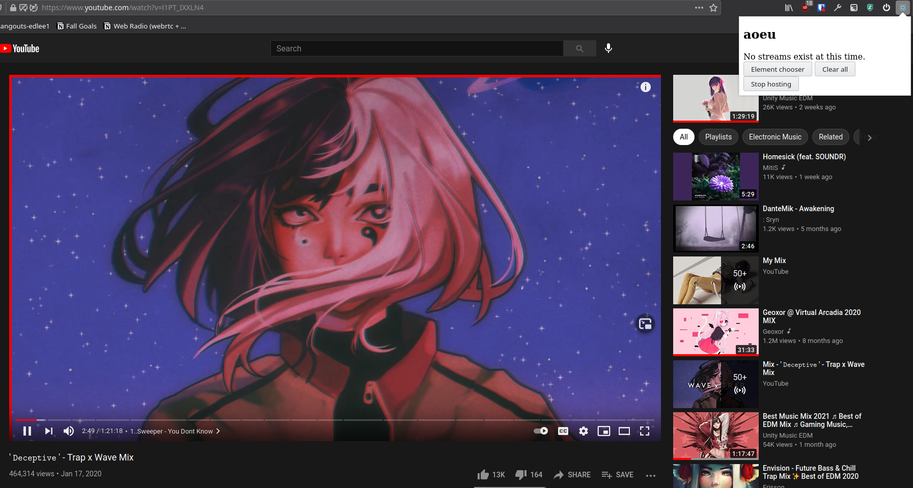
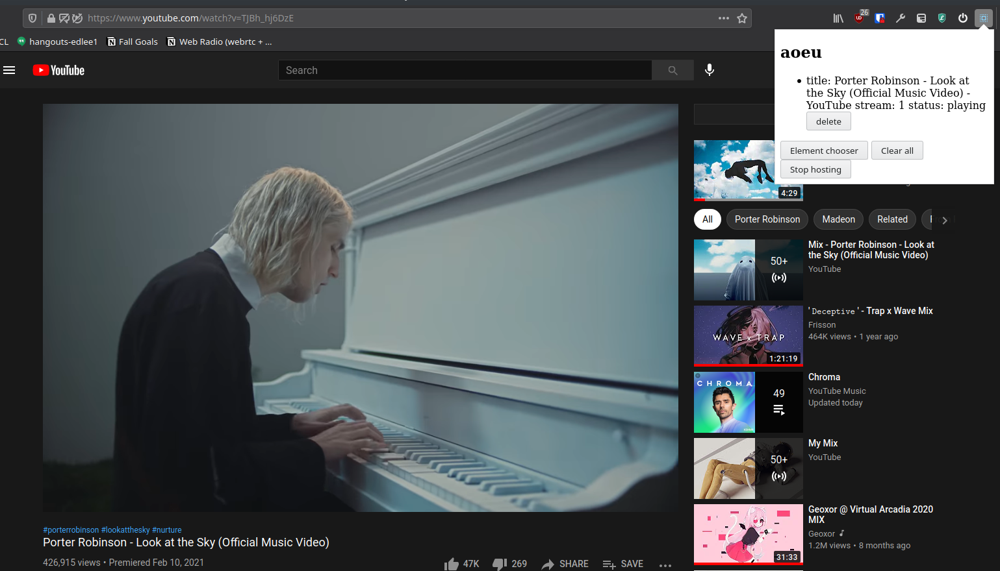
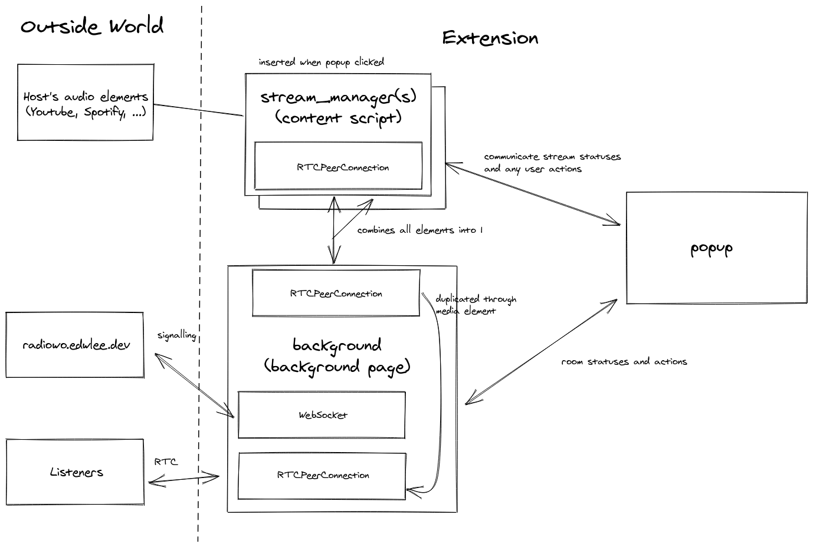

# Radi-owo Browser Extension

Browser extension for selecting media elements playing music and directing the
audio streams from those elements through WebRTC to some destination.
Example screenshots are listed below:

choosing | streaming
--|--
 | 

## Architecture


The main flow for streaming is that:
1. A user clicks "choose element" in popup 
1. Popup loads content script and sends it "choose-element" message
1. Content script searches for media elements and waits for user to pick one.
1. An RTCPeerConnection is created by the content script for the selected element with `captureStream`.
1. The connection connects with a local RTCPeerConnection on the background page (signalling done through Runtime.Port).
1. The background page collects all selected streams into a single RTCPeerConnection.
1. This single RTCPeerConnection is streamed to any listeners (signalling done through web sockets on [radiowo.edwlee.dev](https://radiowo.edwlee.dev))

## Building extension
My Node version: `v13.14.0` and NPM version: `6.14.4` (not sure how much this matters)

```
npm install
npm run build-prod # build with production settings
npm run prod # live-update builds with prod settings
```
(See `package.json` for any other commands you might want to try.)

Then use `publish/manifest.json` as required extension manifest.

### Publishing extension(?)
Run `make package` to create `radiowo.zip`.
